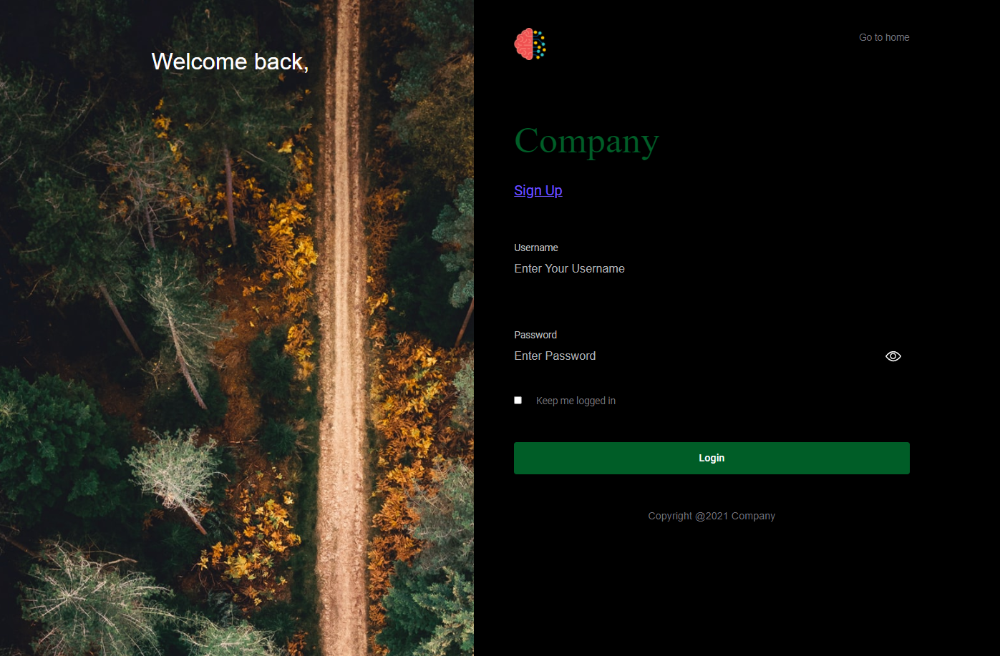
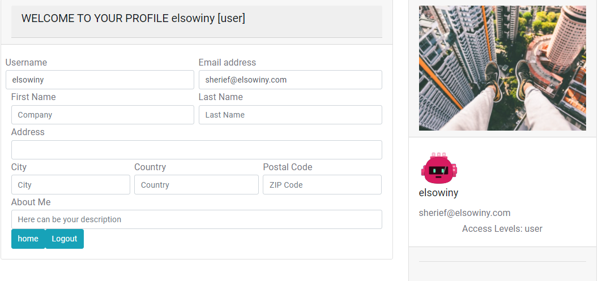

### MongoDB TypeScript Passport-Session backend with React front-end client




#### Features:
<ul>
<li>Typescript</li>
<li>Validation/Middleware</li>
<li>SudoRoutes</li>
<li>Protected Routes</li>
<li>Front-end client interface</li>
<li>User access levels</li>
<li>Session storage</li>
<li>MongoDb</li>
<li>Passport</li>
</ul>

#### Overview
MongoDB must be setup and running for the server to connect. A default string is provided, in config, but can be reconfigured. MongoDB automatically creates the collections for you.

A function is provided that populates the database with usertpes, that is used for access later.

A client UI is provided in React, where navigating to ```adminclient/``` and running ```npm install```, where stat up the UI. The first user created is given an admin status, where the server handles the logic. 


# Prerequisites

- Install dependencies

```
cd <project_name>
npm install
```

- Build and run the project with auto reload (nodemon)

```
npm run server
```

- Build and run the project

```
npm run start
```
- Compile

```
npm run compile
```

- Run in dev

```
npm run dev
```

- Run in production

```
npm run production
```

Finally, navigate to `http://localhost:11000/` and you should see the API running!


## MongoDB
Put the MongoURI string into the default.json file located in ```/config```

The app uses a function called ```initAndFill()``` located in the server file, that populates the database with user data types only once. (Checks if the database already has data and wont update on subsequent runs)


## Models
```User``` 
```typescript 
//Interface to model the user Schema for TypeScript. Includes an avatar string (svg) created with a util function upon registration
@param email:string
@param username:string
@param avatar:string
@param userAccess:ref=> [UserType._id]

 ```
 
```UserType``` 
```typescript
//Interface to model the user type Schema for TypeScript. There is a config to instantiate and fill the database with default types const userTypes = {
//      admin: "admin",
//      user: "user",
//      moderator: "moderator",
//      banned: "banned",
//  };
@param accessRights:string
 ```


## Routes

#### Register
###### **Requires email and password and passwordConfirm and username
###### ***Middleware handles validation
###### ****Passport handles session storage with connect-mongo
| Route | Description|
| -----|-----|
| **POST /register**| Create new user from username, email and password|

`POST localhost:11000/register`
```json

{"email": "sample@gmail.com",
  "username":"test",
  "password": "123456",
  "confirmPassword":"123456"
  }
```

`Response`
```json
{
    "message": "User registered successfully",
    "verified": true,
    "user": {
        "username": "test",
        "email": "sample@gmail.com",
        "accessLevels": [
            "user",
            "admin"
        ]
    }
}
```

#### SudoRegister
###### ***Middleware handles validation
| Route | Description|
| -----|-----|
| **POST /sudoregister**| Create new user requiring an admin status to access|

```json
{
  "email": "sampleAdmin@gmail.com",
  "username":"test1",
  "password": "123456",
  "confirmPassword":"123456",
  "accessLevels":["admin","moderator","user"]
  }
```
`Response`
```json
{
   
    "message": "User registered",
    "error": false,
    "user": {
        "email": "sampleAdmin@gmail.com",
        "username": "test1",
        "userAccess": [
            "61b96634b752f03f85063594",
            "61b96634b752f03f8506359a",
            "61b96634b752f03f85063598"
        ],
        ...
    }
}
```
#### Login
###### ***Middleware handles validation
###### ***Passport also handles validation and signing in
| Route | Description|
| -----|-----|
| **POST /login**| Logs user in if validated|

```json
{
  "username":"test1",
  "password": "123456",
  "confirmPassword":"123456"
}
```

`Response`
```json
{
    "verified": true,
    "message": "welcome to your profile",
    "user": {
        "_id": "61bc000948ada14844b7a840",
        "email": "sampleAdmin@gmail.com",
        "username": "test1",
        "userAccess": [
            "61b96634b752f03f85063594",
            "61b96634b752f03f8506359a",
            "61b96634b752f03f85063598"
        ],
        ...
    }
}
```
#### Logout
###### ***Passport handles
| Route | Description|
| -----|-----|
| **get /logout**| Logs user out if validated|


`Response`
```json
{
    "message": "You have been logged out"
}
```

#### Profile
###### ***Passport handles ensuring user is logged in
| Route | Description|
| -----|-----|
| **get /profile**|If user is logged in, retrieve profile|


`Response`
```json
{
    "verified": true,
    "message": "welcome to your profile",
    "user": {
        "_id": "61bc000948ada14844b7a840",
        "email": "sampleAdmin@gmail.com",
        "username": "test1",
        "userAccess": [
            "61b96634b752f03f85063594",
            "61b96634b752f03f8506359a",
            "61b96634b752f03f85063598"
            ...
    }
}
```


## Project Structure

The most obvious difference in a TypeScript + Node project is the folder structure. In a TypeScript project, it's best to have separate _source_ and _distributable_ files. TypeScript (`.ts`) files live in your `src` folder and after compilation are output as JavaScript (`.js`) in the `dist` folder.

The full folder structure of this app is explained below:

> **Note!** Make sure you have already built the app using `npm run start`

| Name               | Description                                                                                                                                                   |
| ------------------ | ------------------------------------------------------------------------------------------------------------------------------------------------------------- |
| **adminclient**         | Client UI in React for registering/login/viewing profile                                                        |
| **config**         | Contains config environment to be used by the config package, such as MongoDB URI, jwtSecret, and etc.                                                        |
| **dist**           | Contains the distributable (or output) from your TypeScript build                                                                                             |
| **node_modules**   | Contains all your npm dependencies                                                                                                                            |
| **src**            | Contains your source code that will be compiled to the dist dir                                                                                               |
| **src/controllers** | Contains the controllers for viewing profile/ signing up/ logging in/ logging out   
| **src/database** | Contains the initial data population for database and database connection                                                                                                                                                                                              |
| **src/middleware** | Contains middleware for login, registration and authentication. Checks for validation of values and handles appropriate responses                                                                |
| **src/models**     | Models defined are User, UserType                                     |
| **src/passport**     | Passport config for user auth                                      |
| **src/routes**     | Contains routing logic for routes defined earlier                                                           |
| **src/services**     | Handles communicating to our database                                     |
| **src/utils**     | Contains utility functions designed to help with generating an avatar for the user as well as converting the user access types to readable string types                                     |
| **src/server.ts**  | Entry point to your express app                                                                                                                               |
| package.json       | File that contains npm dependencies as well as build scripts                                                  |
| tsconfig.json      | Config settings for compiling server code written in TypeScript                                                                                               |
| tslint.json        | Config settings for TSLint code style checking                                                                                                                |

### Configuring TypeScript compilation

TypeScript uses the file `tsconfig.json` to adjust project compile options.
Let's dissect this project's `tsconfig.json`, starting with the `compilerOptions` which details how your project is compiled.

```json
    "compilerOptions": {
    "module": "commonjs",
    "esModuleInterop": true,
    "target": "es6",
    "noImplicitAny": true,
    "moduleResolution": "node",
    "sourceMap": true,
    "outDir": "dist",
    "baseUrl": ".",
    "paths": {
      "*": ["node_modules/*", "src/types/*"]
    }
  }
```

| `compilerOptions`            | Description                                                                                                                                                |
| ---------------------------- | ---------------------------------------------------------------------------------------------------------------------------------------------------------- |
| `"module": "commonjs"`       | The **output** module type (in your `.js` files). Node uses commonjs, so that is what we use                                                               |
| `"esModuleInterop": true,`   | Allows usage of an alternate module import syntax: `import foo from 'foo';`                                                                                |
| `"target": "es6"`            | The output language level. Node supports ES6, so we can target that here                                                                                   |
| `"noImplicitAny": true`      | Enables a stricter setting which throws errors when something has a default `any` value                                                                    |
| `"moduleResolution": "node"` | TypeScript attempts to mimic Node's module resolution strategy. Read more [here](https://www.typescriptlang.org/docs/handbook/module-resolution.html#node) |
| `"sourceMap": true`          | We want source maps to be output along side our JavaScript. See the [debugging](#debugging) section                                                        |
| `"outDir": "dist"`           | Location to output `.js` files after compilation                                                                                                           |
| `"baseUrl": "."`             | Part of configuring module resolution. See [path mapping section](#installing-dts-files-from-definitelytyped)                                              |
| `paths: {...}`               | Part of configuring module resolution. See [path mapping section](#installing-dts-files-from-definitelytyped)                                              |

The rest of the file define the TypeScript project context.
The project context is basically a set of options that determine which files are compiled when the compiler is invoked with a specific `tsconfig.json`.
In this case, we use the following to define our project context:

```json
    "include": [
        "src/**/*"
    ]
```

`include` takes an array of glob patterns of files to include in the compilation. This project is fairly simple and all of our .ts files are under the `src` folder.

### Running the build

All the different build steps are orchestrated via [npm scripts](https://docs.npmjs.com/misc/scripts).
Npm scripts basically allow us to call (and chain) terminal commands via npm.
This is nice because most JavaScript tools have easy to use command line utilities allowing us to not need grunt or gulp to manage our builds.
If you open `package.json`, you will see a `scripts` section with all the different scripts you can call.
To call a script, simply run `npm run <script-name>` from the command line.
You'll notice that npm scripts can call each other which makes it easy to compose complex builds out of simple individual build scripts.
Below is a list of all the scripts this template has available:

| Npm Script     | Description                                                                                   |
| -------------- | --------------------------------------------------------------------------------------------- |
| `tsc`          | Transpiles TypeScript codes to JavaScript.                                                    |
| `watch-tsc`    | Transpiles TypeScript codes to JavaScript, with auto reload.                                  |
| `deploy`       | Runs node on `dist/server.js` which is the app's entry point.                                 |
| `watch-deploy` | Runs node on `dist/server.js` which is the app's entry point, with auto reload.               |
| `server`       | Transpiles TypeScript codes to JavaScript then run node on `dist/server.js` with auto reload. |
| `start`        | Transpiles TypeScript codes to JavaScript then run node on `dist/server.js`.                  |
| `compile`        | Transpiles TypeScript codes to JavaScript while also removing the old dist folder using rimraf`.                  |
| `production`        | Runs app in production`.                  |
| `dev`        | Runs app in dev


Since we're developing with TypeScript, it is important for the codes to be transpiled first to JavaScript before running the node server. It is best to deploy the app using: `npm run server` or `npm run start` command.

